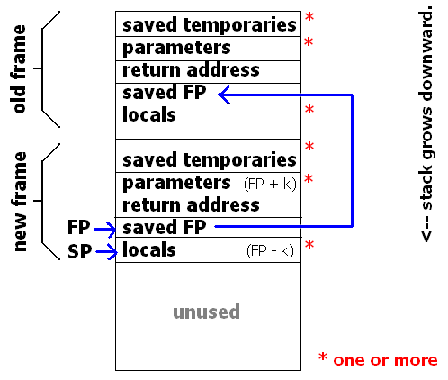

## 1. 常规调用
程序栈的布局如下图所示：



> 1. BP/FP (base pointer or frame pointer)，指向当前函数栈帧的开始位置，通过EBP可取到传入的参数。
> 2. SP (stack pointer)，指向当前栈顶位置。
> 3. return address，返回到调用函数(caller function)后执行的程序指令地址(program counter)。

调用函数的压栈过程(不同架构流程可能会有差异)：
> 1. caller（调用方）将本地变量或者临时变量压入栈顶（**每次压入操作都会引起SP的变化**）；
> 2. caller将调用参数压入栈顶；
> 3. caller将下一条要执行的指令地址(PC)压入栈顶，这样函数调用返回后，caller可以继续往下执行；
> 4. callee（被调用方）将BP/FP压入栈顶（**此时BP/FP指向的是caller的栈帧开始位置**）；
> 5. callee将BP/FP的值设置为SP（**此时BP/FP指向callee的栈帧开始位置**）；
> 6. callee将本地变量或临时变量压入栈顶。

函数返回的出栈过程：
> 1. callee恢复SP的值为BP/FP；
> 2. callee恢复BP/FP的值为当前栈顶的值；
> 3. callee恢复PC的值
> 4. caller弹出栈顶的参数；
> 5. caller根据栈顶的值恢复本地变量;
> 6. caller继续执行PC指向的指令。

## 2. 协程切换
协程主要有以下特点：

1. 栈帧保存在由程序自己申请的内存区域，而非系统默认的程序栈。
2. 程序自行完成函数的上下文切换，而非通过return操作。

因此要实现上述特点需要至少完成如下工作：
> 1. 如果要实现函数能够在自定义的栈帧上执行，需要将寄存器SP的值设置为自定义栈帧的栈顶指针。
> 2. 同时为了保证首次进入子协程时，执行到正确的函数，需要将寄存器IP(Instruction Pointer，是存放下次将要执行的指令在代码段的偏移量)的值设置为子协程入口函数的指针地址。然后通过自定义的上下文切换函数，确保正确的函数切换。
> 3. 向子函数传参。一般以结构指针的方式，所以将参数所在内存的地址传入寄存器DI(di,si,dx,cx,r8,r9，分别用来保存第1~6的参数)。（i386架构，参数是以压栈的方式传入，所以需要在上下文切换前将参数所在的内存地址压入自定义栈帧的栈顶位置）。
> 4. 实现自定义上下文切换的函数，一般以汇编语言实现。保存old协程的寄存器信息，将new协程的上下文信息写入寄存器。执行new协程寄存器IP指向的指令。

## 3. 协程库的基本功能

### 3.1 init
> 1. 申请协程对象，放入管理类。

### 3.2 resume
> 1. 如果协程未执行过，申请栈帧，初始化协程寄存器信息，实现上下文切换，进入子协程执行；
> 2. 如果协程已执行过，则根据保存的协程上下文信息，恢复执行现场，继续上一次的中断处执行。

### 3.3 yield
> 1. 协程主动让出CPU，需要保存当前协程的上下文信息；
> 2. 切换到主协程。


## 4. 备注

子协程正常执行完成后，需要手动切换回主协程（协程库负责此操作），否则会因为没有正确的return address而导致进程异常。

比如，如果是ucontext实现，需要将子协程的`uc_link`指向主协程的上下文信息。

~~或者，像libco这种，在上下文切换时，并不直接切换到子协程的入口函数，而是协程库自己封装的通用入口函数。在该入口函数内调用子协程的入口函数，这样在子协程正常执行完并返回后，由通用入口函数完成主协程的切换。~~

## 5. 使用协程可能遇到的问题
### 5.1 栈变量过大
如果栈变量太大，可能导致协程爆栈，触发不可预知的问题。
> 1. 消耗内存，因为协程在挂起时，协程栈是保存在内存中的，巨大的栈变量会导致大量的内存占用。
> 2. 写乱栈空间，多个协程的栈空间可能是连续的，如果其中一个协程爆栈，会导致临近的协程栈被写坏，无法正常执行，类似内存越界。

为了解决该问题，会考虑将协程栈变量分配到单独的内存空间，然后通过指针的方式传递到协程栈。

### 5.2 栈变量切换前后不一致
协程换入换出过程中，要注意保证切换前后栈变量指向的内存数据前后一致，否则也是难以定位的问题。

以下场景可能会遇到该问题：
> 第一步中DB返回的Record结构内如果有指针变量，在执行第二步切换，再切回来后，Record内的指针所指向的DB的缓冲区数据可能已经不一致了。
```c
// 1. RequestDBRecord 
    SendReq() {
        Yield();
    }
    RecvRsp(Record);

// 2. AnotherAsyncProcess
    OtherProcess() {
        Yield();
    }
    Process(Record)
```

## References
1. [Stack Frame]

[stack frame]: http://en.citizendium.org/wiki/Stack_frame