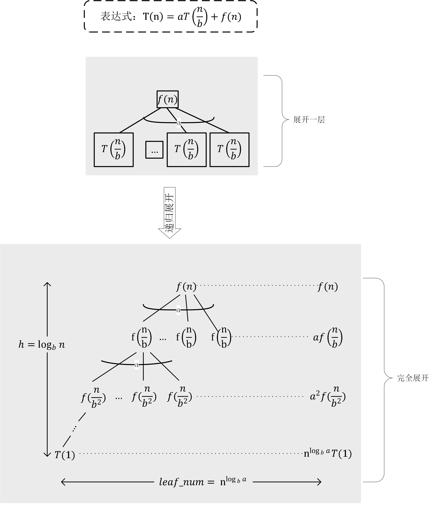

### 表达式特征:
T(n) = aT(n/b) + f(n)

递归展开后可以得到如下表示：

其中：

高度: ![h]

叶子个数：![leaf]

情况1：

如果每一层拥有同等权重。

所以：![t_n_case1]

情况2：

如果从根到叶子呈现指数递减，则根节点对整体权重起支配作用。

所以：![t_n_case2]

情况3：

如果从根到叶子节点呈现指数递增，则叶子节点对整体权重起支配作用。

![t_n_case3]

[h]:../pics/h_log_bn.png 
[leaf]:../pics/leaf_num.png
[f_n]:../pics/f_n.png
[t_n_case1]:../pics/t_n_case1.png
[t_n_case2]:../pics/t_n_case2.png
[t_n_case3]:../pics/t_n_case3.png

<!--
T(n) = {height} * n^{\log_{b}a} = {n^{\log_{b}a}}*{\log_{b}n}
T(n) = O(n^{\log_{a}b})
T(n) = O(f(n))
height = \log_{b}n
{leaf\_num} = a^{\log_{b}n}= n^{\log_{b}a}

-->